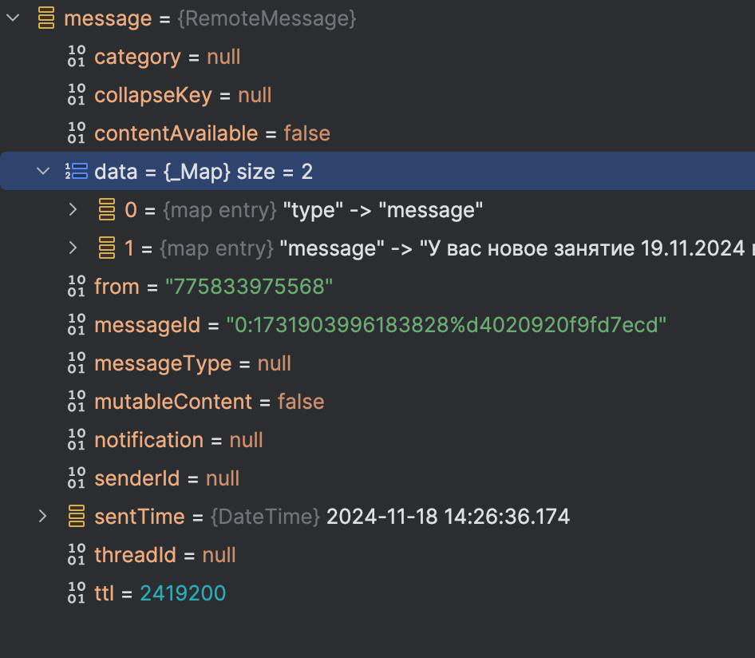

### Глобальная задача
Приложение поддерживает пуш-уведомления на основе Firebase. Теперь пришла 
задача поддержать Huawei-сервисы

Также:
- Токен должен отправляться после логина, и при изменении токена

### Контекст
- Приложение может перезапускаться. То есть реинициализировать все зависимости
- инициализация с помощью injectable.
- Приложение пользуется некоторыми публичным API класса уведомлений. Примеры 
  в [notification_consumer.dart](../notification_consumer.dart)

### Примеры RemoteMessage от разных серверов

Flavor.mobifitness:

Flavor.fitness1c

